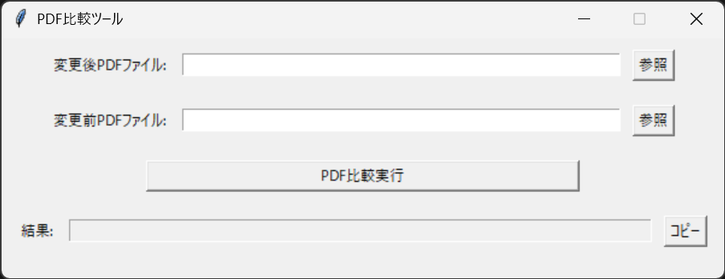

### README.md
- [日本語版](./README.md)
- [English Version](./README_EN.md)

# PDF Comparator
This tool compares two PDF files and highlights the differences. [Output Example](./sample/new__old.pdf)

## 1. How to Launch the PDF Comparator
### 1.1 Launch from Executable File (Recommended)
1. Download the [executable file](https://github.com/kouki-0926/PDF_Comparator/raw/refs/heads/master/dist/PDF比較ツール.exe).
2. Double-click the downloaded `PDF比較ツール.exe` to launch it.

### 1.2 Launch from Source Code (Not Recommended)
1. Install Python 3.12 or later.
2. Install required libraries.
```sh
$ pip install pdf2image pillow
```
3. Clone the repository.
```sh
$ git clone git@github.com:kouki-0926/PDF_Comparator.git
```
4. Run main.py.
```sh
$ python PDF_Comparator/main.py
```

## 2. Usage
1. Select two PDF files you want to compare.
2. Click the “PDF比較実行” button.
3. A PDF file with differences highlighted will be output.


## 3. How to Create an Executable File
```sh
$ pip install pyinstaller
$ pyinstaller PDF_Comparator/main.py --name=PDF比較ツール --icon=img/icon.png --onefile --noconsole
```
