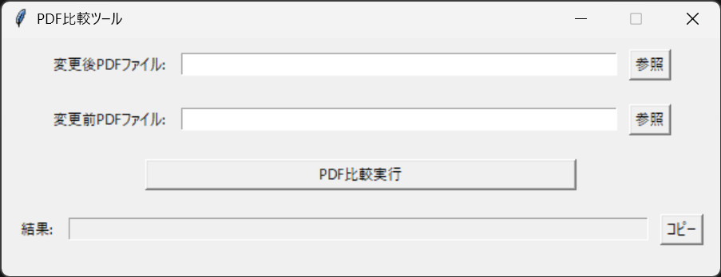

### README.md
- [日本語版](./README_JP.md)
- [English Version](./README.md)

# PDF比較ツール
2つのPDFファイルを比較し，差分をハイライト表示するツールです．[出力例](./sample/new__old.pdf)

## 1. PDF比較ツールの起動方法
### 1.1 実行ファイルから起動(推奨)
1. [実行ファイル](https://github.com/kouki-0926/PDF_Comparator/raw/refs/heads/master/dist/PDF比較ツール.exe)をダウンロードする．
2. ダウンロードした`PDF比較ツール.exe`をダブルクリックして起動する．

### 1.2 ソースコードから起動(非推奨)
1. Python 3.12以降をインストールする．
2. 必要なライブラリをインストールする．
```sh
$ pip install pdf2image pillow
```
3. リポジトリをクローンする．
```sh
$ git clone git@github.com:kouki-0926/PDF_Comparator.git
```
4. main.pyを実行する．
```sh
$ python PDF_Comparator/main.py
```

## 2. 使い方
1. 比較したいPDFファイルを2つ選択する．
2. 「PDF比較実行」ボタンをクリックする．
3. 差分がハイライトされたPDFファイルが出力される．


## 3. 実行ファイルの作成方法
```sh
$ pip install pyinstaller
$ pyinstaller PDF_Comparator/main.py --name=PDF比較ツール --icon=img/icon.png --onefile --noconsole
```
